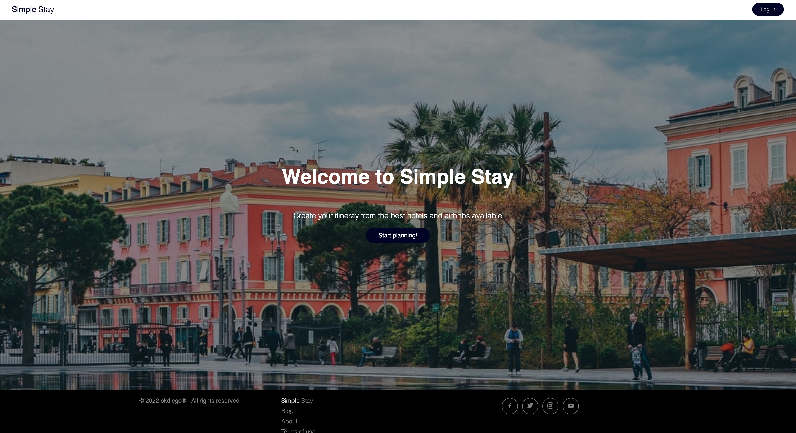

## Concordia's full-stack web development final project

### Simple Stay

A simple travel application to help users plan for a vacation by providing aggregated data from multiple sources.

<a href="https://youtu.be/Z03-h7GUej0" target="_blank">Youtube demo</a>

### Project setup

This project was created with the MERN stack development workflow, with React as the front-end framework, and MongoDB, Express, and Node for the server, backend and database frameworks.

### Available scripts

In the project directory you can split the terminal and run:

#### Backend

`cd server`

`yarn install`

`yarn start`

#### Frontend

`cd client`

`yarn install`

`yarn start`
